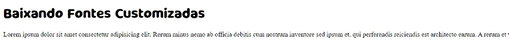

# Baixando Fontes Customizadas
Projeto para exemplificar como baixar as fontes customizadas (foi usado o site dafont.com) utilizando HTML e CSS.

## Resultado Final

## Tecnologias Utilizadas
- HTML
- CSS